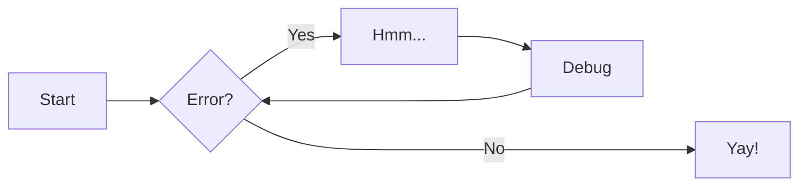

# Image insert


# insert a piece of code

```commandline
docker compose up
```

```python
def create_docs():
    print(123)
```

:memo: go and study 🦷

## Tasks
- ✅ create project
- [ ] create site

## Tables
| content   | another column | add +       |                             Notes |
|:----------|:--------------:|-------------|----------------------------------:|
| my data 1 |    value 1     | more data 1 | nothing special [ergdfg](gdfgfdg) |
| my data 1 |    value 1     | more data 1 |                   nothing special |

